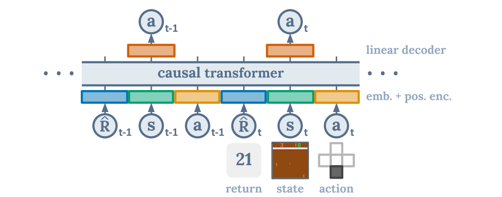
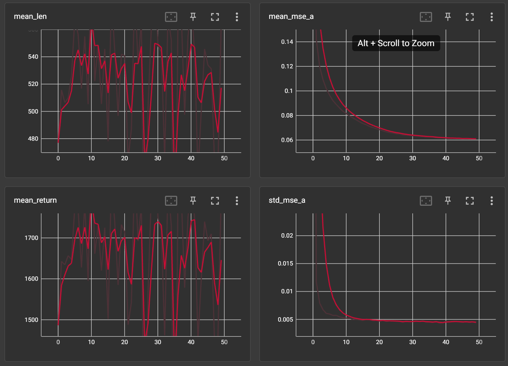

# DecisionTransformer_StepbyStep

## Intro

Decision Transformer: A brand new Offline RL Pattern.

这是关于[NeurIPS 2021 ](https://paperswithcode.com/conference/neurips-2021-12)热门论文Decision Transformer的复现。

👍 原文地址: [Decision Transformer: Reinforcement Learning via Sequence Modeling](http://proceedings.neurips.cc/paper/2021/file/7f489f642a0ddb10272b5c31057f0663-Paper.pdf)

👍 官方的Git仓库: [decision-transformer(official) ](https://github.com/kzl/decision-transformer)

## Decision Transformer

Decision Transformer属于Offline RL，所谓Offline RL，即从次优数据中学习策略来分配Agent，即从固定、有限的经验中产生最大有效的行为。

### 👀️ Motivation

DT将RL看成一个序列建模问题（Sequence Modeling Problem ），不用传统RL方法，而使用网络直接输出动作进行决策。传统RL方法存在一些问题，比如估计未来Return过程中Bootstrapping过程会导致Overestimate； 马尔可夫假设;

DT借助了Transformer的强大表征能力和时序建模能力。

- Decision Transformer的表现达到甚至超过了目前最好的基于dynamic programming的主流方法；
- 在一些需要**long-term credit assignment**的task【例如**sparse reward**或者**delayed reward**等】，Decision Transformer的表现远超过了最好的主流方法.

### 🚀️ DT的核心思想



Decision Transformer的核心思想； States、Actions、Returns被Fed into Modality-Specific的线性Embedding；并添加了带有时间步信息的positional episodic timestep; 这些Tokens被输入一个GPT架构，使用a causal self-attention mask来预测actions。

### 🎉️ DT的优势

1. 无需Markov假设;
2. 没有使用一个可学习的Value Function作为Training Target;
3. 利用Transformer的特性，绕过长期信用分配进行“**自举bootstrapping**”的需要，避免了时序差分学习的“**短视**”行为;
4. 可以通过self-attention直接执行信度分配。这与缓慢传播奖励并容易产生干扰信号的 Bellman Backup 相反，可以使 Transformer 在奖励稀少或分散注意力的情况下仍然有效地工作.

## Dependencies

### 1. [D4RL](https://sites.google.com/view/d4rl/home) ( Dataset for Deep Data-Driven Reinforcement Learning )

### 2. [MUJOCO](https://github.com/deepmind/mujoco/releases/tag/2.1.0) 210

```
# 安装之前先安装absl-py和matplotlib 
pip install absl-py 
pip install matplotlib 

"""
git clone https://github.com/rail-berkeley/d4rl.git
cd d4rl
pip install -e . # 这种方法不好使 !! 
"""

#首先在https://github.com/deepmind/dm_control这个库git clone
# cd
pip install -r requirement.txt 
# 然后 
pip install matplotlib 
# 然后 https://github.com/takuseno/d3rlpy 
pip install d3rlpy 
# 然后安装mujoco 210  
# 直接安装，然后添加环境变量 
# 装完之后进d4rl文件夹下
python setup.py install 
# 成功安装 d4rl 1.1 
```

### 3. [GPT-2](https://openai.com/blog/better-language-models/)

---

```
pip install transformers
```

## Experiments

### Group1:   Decision Transformer — **Hopper-v3-Medium-Dataset**

#### 参数Config 

```
class Config:
    env = "hopper"
    dataset = "medium"
    mode = "normal" # "delayed" : all rewards moved to end of trajectory
    device = 'cuda'
    log_dir = 'TB_log/'
    record_algo = 'DT_Hopper_v1'
    test_cycles = datetime.datetime.now().strftime('%Y%m%d_%H%M%S')

    # 模型
    model_type = "DT"
    activation_function = 'relu'

    # Scalar
    max_length = 20 # max_len # K
    pct_traj = 1.
    batch_size = 64
    embed_dim = 128
    n_layer = 3
    n_head = 1
    dropout = 0.1
    lr = 1e-4
    wd = 1e-4
    warmup_steps = 1000
    num_eval_episodes = 100
    max_iters = 50
    num_steps_per_iter = 1000

    # Bool
    log_to_tb = True
```

#### 效果


